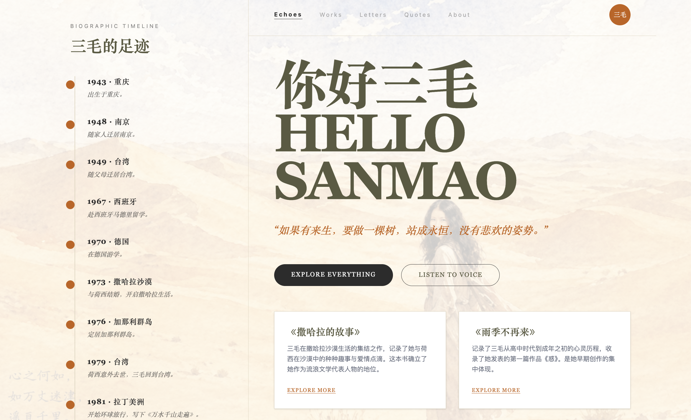
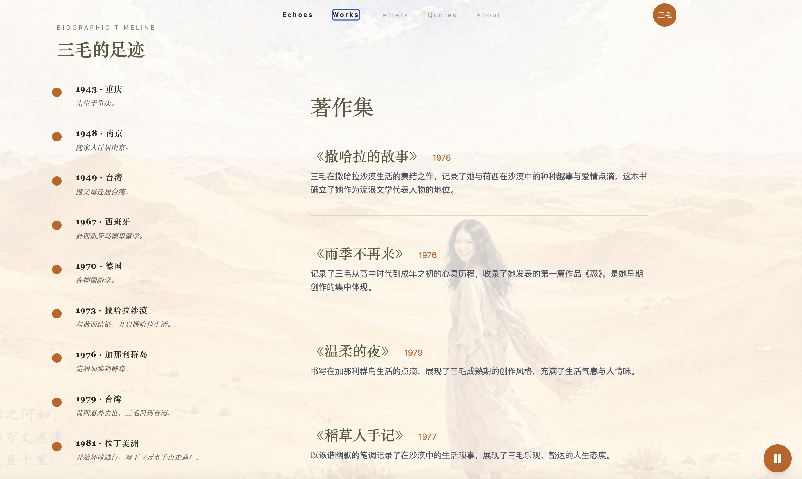
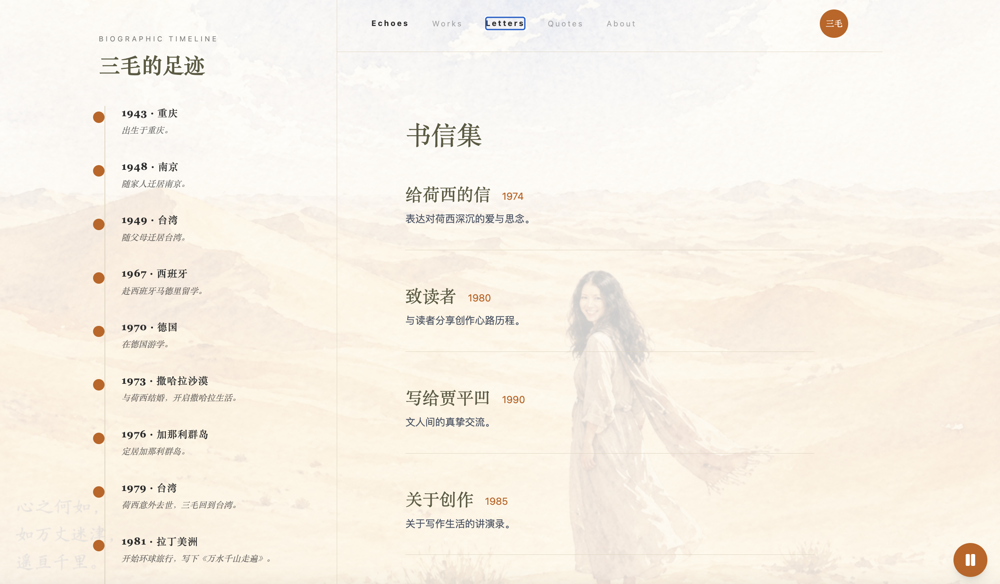
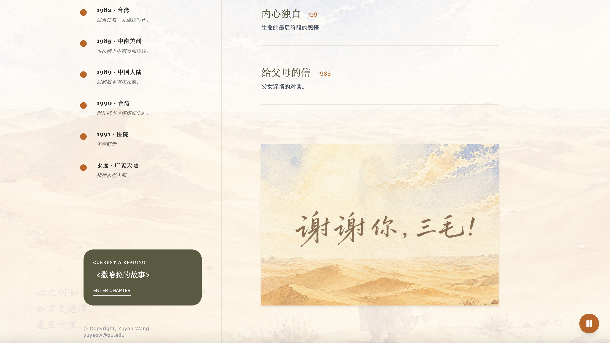
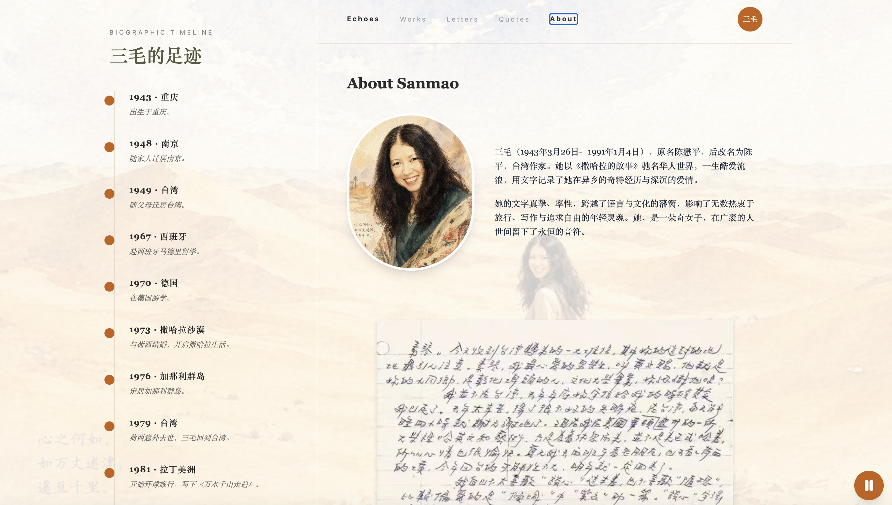

# 🌵 你好三毛 (Hello Sanmao)

[](https://sanmao.vercel.app/)
[](https://reactjs.org/)
[](https://vitejs.dev/)
[](https://tailwindcss.com/)

*An immersive web journey through the life, travels, and literature of the legendary writer, Sanmao (Echo).*

### 🌐 [Visit the Live Website](https://sanmao.vercel.app/)


## 📖 About The Project

"你好三毛" (Hello Sanmao) is a beautifully crafted, interactive tribute to the iconic Chinese contemporary writer and traveler, Sanmao (Chen Ping). Known for her deeply personal and autobiographical writing in *The Stories of the Sahara*, Sanmao's life was a testament to freedom, love, and wandering. 

This web application serves as a digital museum and interactive essay, allowing users to trace her footprints across the globe, read her most profound letters and quotes, and immerse themselves in her enduring spirit.

**Motivation**: *"做这个APP，是因为三毛深刻影响了我的少年时代，她的文字是永不凋零的沙漠之花。"* 
*(Created because Sanmao profoundly influenced my youth; her words are the unfading desert flowers.)*


## ✨ Features

*   **🌍 Interactive Footprints (Timeline)**: Follow Sanmao's life journey from Chongqing to Taipei, Madrid, the Sahara Desert, and the Canary Islands.
*   **✉️ Letters & Visuals**: A polaroid-style gallery showcasing fragments of her life, travels, and deeply personal letters.
*   **💬 Curated Quotes**: A collection of Sanmao's most famous, touching, and profound literary quotes.
*   **🎵 Immersive Audio Experience**: Built-in background music player (`sanmao.mp3`) that seamlessly plays as you read and browse the site.
*   **📜 Biography & Visual Design**: Clickable interactive elements, featuring her original handwriting (`handwriting.png`) and portrait (`sanmao.png`), set against a theme-appropriate aesthetic backdrop (`sanmao_bg.png`).
*   **🎨 Minimalist & Elegant UI**: Thoughtful typography (Serif style), warm earthy color palettes (Sahara sands, vintage paper), and smooth micro-interactions.


## 🖼️ App Preview

<p align="center">
  
  
</p>

<p align="center">
  
  
</p>

<p align="center">
  
</p>


## 🛠️ Tech Stack

*   **Framework**: [React 18](https://reactjs.org/) + [Vite](https://vitejs.dev/)
*   **Language**: [TypeScript](https://www.typescriptlang.org/)
*   **Styling**: [Tailwind CSS](https://tailwindcss.com/)
*   **Animations**: [Framer Motion](https://www.framer.com/motion/)
*   **Icons**: [Lucide React](https://lucide.dev/)
*   **Deployment**: [Vercel](https://vercel.com/)


## 🚀 Getting Started

To get a local copy up and running, follow these simple steps.

### Prerequisites
*   Node.js
*   npm or yarn

### Installation

1. Clone the repo
   ```sh
   git clone https://github.com/your-username/hello-sanmao.git
   ```
2. Navigate to the project directory
   ```sh
   cd hello-sanmao
   ```
3. Install NPM packages
   ```sh
   npm install
   ```
4. Start the development server
   ```sh
   npm run dev
   ```
5. Open `http://localhost:3000` in your browser.

*Note: Ensure that the static media assets (`sanmao.png`, `sanmao_bg.png`, `handwriting.png`, `thanks_sanmao.png`, and `sanmao.mp3`) are placed correctly in the `/public` directory for images and audio to load.*


## 📁 Project Structure

```text
src/
├── components/
│   ├── AboutPage.tsx      # Biography and handwriting visuals
│   ├── AudioPlayer.tsx    # Background music player widget
│   ├── BiographyModal.tsx # Popup modal for quick bio 
│   ├── Footprints.tsx     # Sidebar timeline of Sanmao's travels
│   ├── Hero.tsx           # Main landing header (Title & hero quote)
│   ├── LettersPage.tsx    # Gallery of visual letters and photos
│   └── QuotesPage.tsx     # Curated quotes list
├── data.ts                # Global application content and timeline data
├── quotesData.ts          # Extracted quotes collection
├── App.tsx                # Main Application layout and routing state
├── index.css              # Global styles, Tailwind imports, Background imagery
└── main.tsx               # React DOM entry point
```


## 🖋️ Author

**Yuyao Wang**
*   Email: [yuyaow@bu.edu](mailto:yuyaow@bu.edu)


## 📄 License & Copyright

© Copyright, Yuyao Wang.

*(Disclaimer: This project is created strictly as a non-commercial tribute/fan project. All rights to Sanmao's texts, images, quotes, and original works belong to their respective copyright holders.)*
